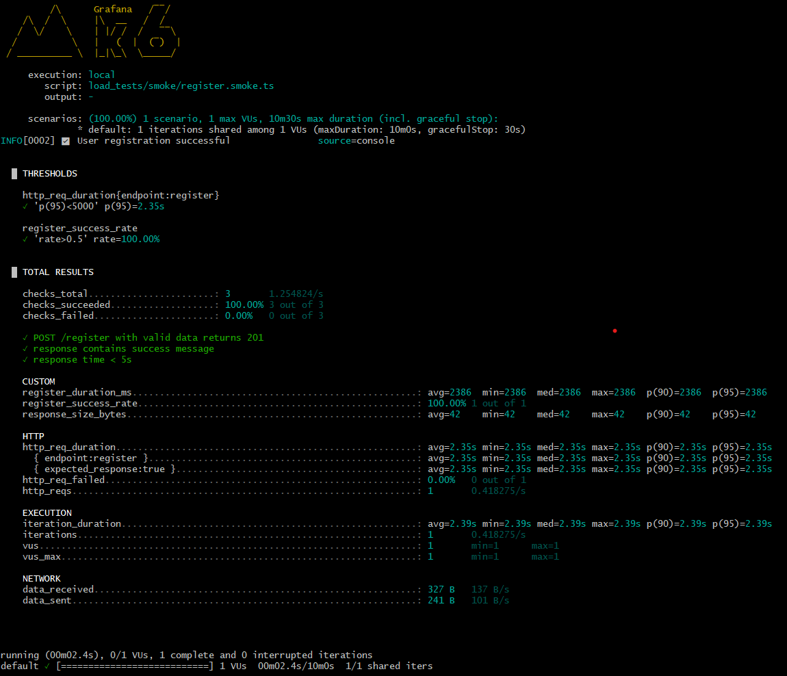

---

## 🧪 Automated Testing

### 1. Unit & Integration Tests (Jest)

- All business logic and API endpoints are covered.
- Test files are in `__tests__/unit/` and `__tests__/intergration/`.

**Run all Jest tests:**
```sh
pnpm test
# or
npm test
```

---

### 2. Load, Smoke, and Stress Tests (k6)

- k6 scripts are in `load_tests/`
- Includes smoke, stress, and basic load scenarios

**Example: Run a smoke test**
```sh
pnpm smoke:task
# or
k6 run load_tests/smoke/task.smoke.ts
```

**Example: Run a stress test**
```sh
pnpm stress:task
# or
k6 run load_tests/stress/tasks.stress.ts
```

---

## 📊 Test Results

Below are sample results from our automated test runs:

### Smoke Test (Register)


<!-- Add more images as you generate them, e.g.:


-->

---

## 🛠️ Setup & Development

1. **Install dependencies**
   ```sh
   pnpm install
   # or
   npm install
   ```

2. **Configure environment variables**
   - Copy `.env.example` to `.env` and set your DB/JWT secrets.

3. **Run the development server**
   ```sh
   pnpm dev
   # or
   npm run dev
   ```

4. **Build for production**
   ```sh
   pnpm build
   # or
   npm run build
   ```

---

## 📚 API Documentation

The API exposes endpoints for user and task management.  
See `index.html` for a browsable list of endpoints, or run the server and visit the root URL.

---

## 📈 k6 + Grafana

You can visualize k6 results in Grafana for advanced performance analytics.  
See [`grafana_k6.md`](grafana_k6.md) for setup instructions.

---

## 🤝 Contributing

Pull requests and issues are welcome!  
Please add tests for any new features or bug fixes.

---

## 📄 License

MIT

---

*Happy testing! 🚦*